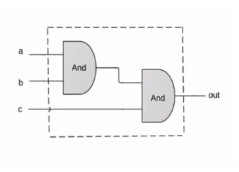
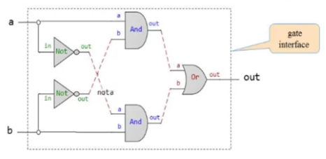
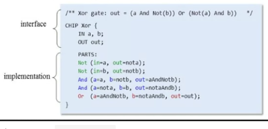

# Week 1: Boolean Functions and Gate Logic

## Boolean logic

- x AND y: x ^ y
- x OR y: x v y
- NOT x: ~x (unary)

## Boolean identities

- Commutative laws:
  - x AND y = y AND x
  - x OR y = y OR x
- Associative laws:
  - x AND (y AND z) = (x AND y) AND z
  - x OR (y OR z) = (x OR y) OR z
- Distributive laws:
  - x AND (y OR z) = (x AND y) OR (x AND z)
  - x OR (y AND z) = (z OR y) AND (x OR y)
- De Morgan Laws
  - NOT(x AND y) = NOT(x) OR NOT(y)
  - NOT(x OR y) = NOT(x) AND NOT(y)

## Boolean Functions Synthesis

- Truth table
- Truth table to boolean expression
  - Write an expression for each row where the result is 1, so that the expression results in 1 only for this row and 0 for all other rows
  - We OR them together in one expression
  - We simplify it

> Theorem: Any boolean function can be represented using an expression containing AND, OR and NOT operations.

Proof: 

- x OR y = NOT(NOT(x) AND NOT(y))
- NAND: x NAND y = NOT(x AND y)

> Theorem: Any boolean function can be represented using an expression containing only NAND operations.

Proof:

- NOT(x) = x NAND x
- x AND y = NOT(x NAND y)

## Logic Gates

Logic gate:
- Elementary (Nand, And, Or, Not, ...)
- Composite (Mux, Adder, ...)

3 way AND composite

Interface and implementation: 
- the gate interface is the gate abstraction
- interface answers the question "what"
- to understand the how, you need to go deeper
- the interface is unique, there is only way to describe the gate's functionality
- but there are several implementation that can achieve it

Circuit implementations
- possibility to implement gate with circuits
- serial latches: AND
- parallel latches: OR

## Hardware Description Language

- Define the requirements, and progress to the interface
- Requirement: build a gate that delivers this functionality
- Gate interface: implemented as an HDL stub file

Gate logic diagram:
- Implements the interface (composed by only AND, OR and NOT gates)
- Allowed to distribute as many signals as we want: fan out

Method:
- inputs and outputs have predefined names
- we name the connections arbitrarily
- HDL file: define interface
  

Interface is unique, implementation varies.

Comments:
- worry about good documentation
- readability is important, code should be self descriptive
- HDL is a functional / declarative language
- static description of the gate logic diagram
- we can write HDL statements in any order with which
- convention: describe diagram from left to right
- convention: use letters A and B as inputs

## Hardware Simulation

Goal: verify that the HDL file delivers the interface of the chip, using a hardware simulator

- `.hdl`: chip implementation
- `.tst`: test scripts= series of commands to the simulator
- `.out`: output file created by the test script as a side effect of the simulation process
- `.cmp`: compare file; compare the output and throw a comparison error if they don't match

## Multi-Bit Buses

- Array of bits
- Think about such a group of bits as a single entity, sometime termed "bus"
- HDLs will provide convenient notation for handling these buses

- Multi way chips
- Buses can be composed from (and broken into) sub-buses
- Syntactic choices of our SDL:
  - Overlaps of sub buses are allowed on output buses of parts
  - Width of internal pins is deduced automatically
  - false and true may be used as buses of any width

## Project Overview

- NAND is the axiom
- Goal: build 15 different gates

Multiplexer:
- Gate that has two inputs, one output, and a selector
- Outputs input depending on the selector
- Example: programmable gate, AND or OR

Demultiplexer:
- Acts like the inverse of a multiplexer
- Gate that has one input, two outputs, and a selector
- Outputs the input depending the selector
- Distributes the single input value into one of two possible destinations
- Defaults to 0