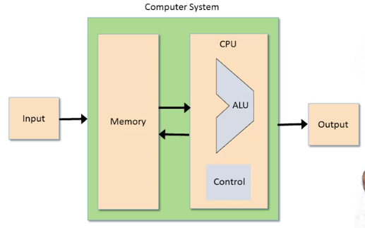
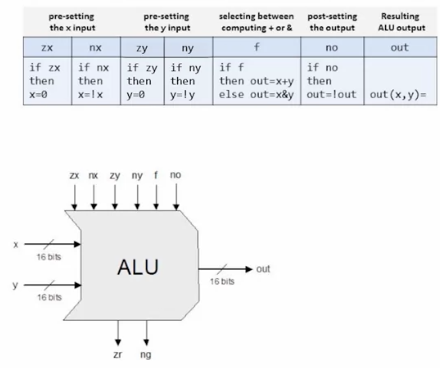

# Week 2: Boolean Arithmetic and the ALU

## Binary Numbers

- N bits = 2 ^ N possibilities
- representing numbers

Binary to decimals:

bn bn-1 bn-2 ... b1 b0 = sum(bi * 2 ^ i)

Maximum with k bits is 2 ^ k - 1

Fixed word size: fixed range of numbers

Negative numbers: first bit (left)

Decimal to binary:

87 decimal = 64 + 16 + 4 + 2 + 1 = 01010111

## Binary Addition

If we implement addition, we have the operations (subtraction, greater than, multiplication, division) basically for free.

Addition:

From right to left:
- 1 + 0 => 1
- 0 + 0 => 0
- 1 + 1 => 0 and 1 as carry

Overflow:

If the two leftmost bits are 1, the carry has no place to go. Usually, we do nothing. 

What the binary addition is really doing, is an addition modulo 2 ^ width of the word size.

Building an Adder

1. Half adder = adds 2 bits
2. Full adder = adds 3 bits
3. Adder = adds 2 numbers

## Negative numbers

- First bit is +/-, 1 is negative
- Complications: 
  - -0?
  - implementations need to handle different cases
  - hardly anyone use it
  
- Represent negative number -x using the positive number 2 ^ n - x
  - 0111 is 7
  - 1000 is -8 instead of 8
  - 1111 is -1 instead of 15
  - positive numbers range 0 ... 2 ^ (n - 1) - 1
  - negative numbers range -1 ... - 2 ^ (n - 1)
  - allows us to use the addition as subtraction (magically)

- Representation us module 2 ^ n
- Addition is module 2 ^ n
- Works because we throw away the overflow bit

Computing -x

2 ^ n - x

= 1 + (2 ^ n - 1) - x 

= 1 + 1111111n - x

To add 1: flip the bits from right to left, stopping the first time 0 is flipped to 1

## Arithmetic Logic Unit

Von Neumann Architecture

ALU:
- = Arithmetic Logic Unit
- computes a function on the two inputs, and outputs the result
- f: one of a family of predefined arithmetic and logical functions
  - Examples: integer addition, multiplication, division, and, or, xor

The Hack ALU
- the one we are going to build
- operates on two 16-bit, two's complement values
- outputs a 16-bit, two's complement values
- which function to compute is set by six 1-bit inputs
- computes one out of a family of 18 functions
- also outputs two 1-bit values: zr and ng
  - zr = 1 only if out == 1, else zr = 0
  - ng = 1 only if out < 0, else ng = 0
