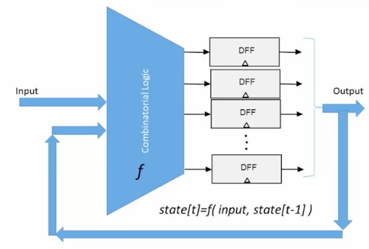
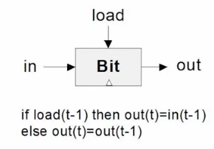
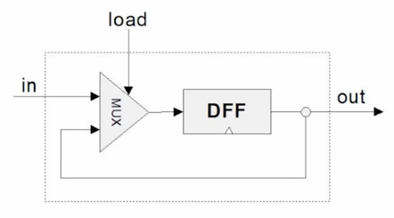
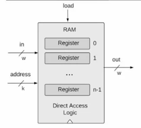
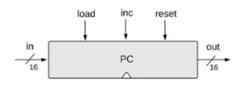

# Week 3: Memory Roadmap

## Sequential Logic

Combinatorial logic:
- so far, we have ignored the issue of time
- the inputs were just "there", fixed and unchanging
- the output was just a function of the input
- the output was computed instantaneously
- this is called combinatorial logic

Hello, Time:
- use the hardware over time (eg loops)
- remember "state" (memory, intermediate results, counters, ....)
- deal with speed (don't ask the computer to perform computations faster than it can)

The Clock
- physical time = continuous
- computers have clock, time is discrete
- discard signal fluctuations (gray area)

Combinatorial logic vs Sequential logic
- Combinatorial: out[t] = func(in[t])
- Sequential: out[t] = func(in[t-1])
  - So it's actually a state: state[t] = func(state[t-1])

## Flip flops

Remembering state
- missing ingredient: remember one bit of information from time t-1 so it can be used at time t
- at the end of time t-1, such an ingredient can be at either of two states: "remembering 0" or "remembering 1"
- this ingredient remembers by flipping between these possible states
- gates that can flip between two states are called flip flops

Clocked Data Flip Flop
- one input and one output
- out[t] = in[t-1]

Implementation of the D Flip Flop
- in this course, it is a primitive
- in many physical implementations, it may be built from actual NAND gates:
  - create a loop achieving an unclocked flip flop
  - isolation across time using a master slave setup
- will not implement this way in this course

Sequential Logic Implementation
- array of flip flop which remember state and is fed back as an input

Remembering For Ever: 1 bit register
- goal: remember an input bit "forever": until requested to load a new value

Implementation

## Memory Units

Von Neumann Architecture, key part is the memory

Memory:
- main memory: RAM
- secondary memory: disks
- volatile / non-volatile (erased or not when disconnected)

RAM:
- Data
- Instructions

Perspective:
- Physical
- Logical

The most basic memory element: Register (as the 1 bit register in the last section)

Multi-bit register of width w: 16-bit, 23-bit, 64-bit

Register's state: the value which is currently stored inside the register

To read the register, probe out (out emits the current value)

To write a value v the register, we set in - v and load - 1

RAM unit
- RAM abstraction: a sequence of n addressable registers, with addresses 0 to n-1
- At any given point of time, only one register in the RAM is selected
- k = width of address input, k = log2 n (for 8 registers, we need 3 bits)
- w = word width: no impact on the RAM logic
- RAM is a sequential chip with a clocked behavior

To read register i:
- set address = i
- result: out emits the state of register i

To set register i to v:
- set address = i
- set in = v
- set load = 1
- result: the state of register i becomes v, and from the next state onward, out emits the state of register i

Why Random Access Memory:
- because irrespective of the RAM size, every register can be accessed in the same time, instantaneously!

## Counters

Where counters come to play:
- cycle through instructions, keep track of the position with counter
- ability to change the counter to an arbitrary number, to skip instructions
- three possible control settings:
  - reset: fetch the first instruction `PC = 0`
  - next: fetch the next instruction `PC++`
  - goto: fetch instruction n `PC = n`

Counter = a chip that realizes this abstraction

